# bare-metal-nested-virtualization

O propósito desse repositório é mostrar formas de virtualização utilizando KVM em um servidor bare metal na AWS

Esse tipo de instâncias EC2 oferecem o melhor dos dois mundos, permitindo que o sistema operacional seja executado diretamente no hardware subjacente, ao mesmo tempo que fornece acesso a todos os benefícios da nuvem.

[Amazon EC2 Bare Metal Instances](https://aws.amazon.com/blogs/aws/new-amazon-ec2-bare-metal-instances-with-direct-access-to-hardware/)

# Pré-requisitos

- Amazon VPC configurada com no minínimo uma subnet pública

# Criando nossa Amazon EC2

Para essa demonstração utilizaremos a EC2 do tipo **i3.metal**:

> [i3.metal](https://aws.amazon.com/pt/ec2/instance-types/i3/)

Logue no console da AWS e selecione EC2 > instances > Launch Instance

<p align="center"> 
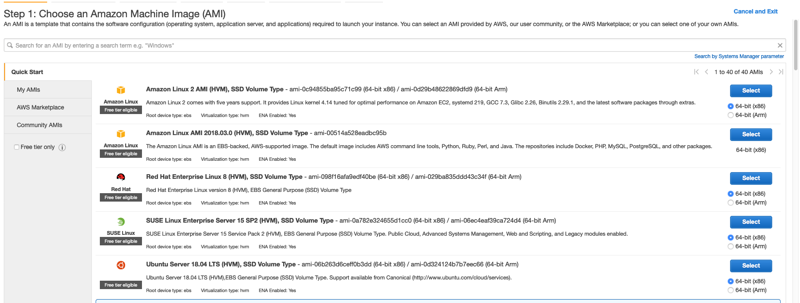
</p>

>Obs: Utilizaremos o Ubuntu 18.04 como sistema operacional

Selecione a instância do tipo i3.large > Configure Instance Details

<p align="center"> 
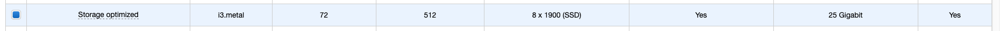
</p>

Selecione a VPC onde você quer fazer o lançamento da sua instância e também a subnet

>Obs: Será necessário realizar SSH na instância portanto, realize o lançamento em uma subnet pública ou possua mecânismos para acessar sua instância (VPN/Bastion)

Selecione a quantidade de GB para o volume Root (Utilizaremos essa máquina virtual para realizar virtualização portanto defina uma quantidade adequada)

<p align="center"> 
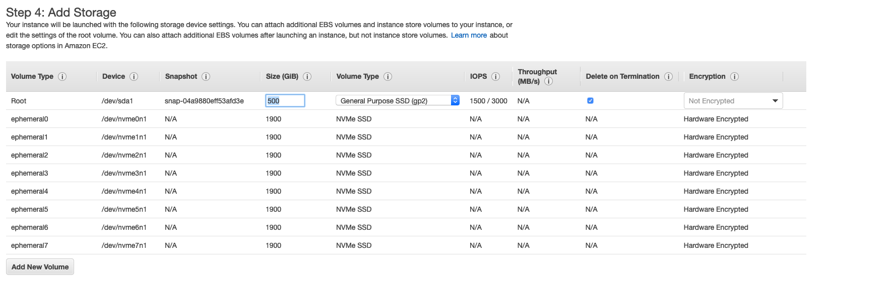
</p>

Defina a Tag Name para a sua EC2

<p align="center"> 
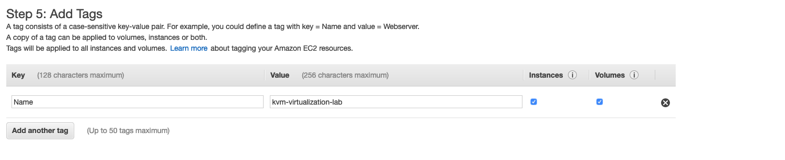
</p>

> Obs: Utilizarei o nome kvm-virtualization-lab

Clique em **Configure Security Group**

Crie um Security Group específico para a sua EC2 ou seleciona um já existente.

>Obs: Lembre-se de verificar as portas necessárias no Security Group para realizar o acesso remoto as nossas máquinas virtualizadas

Clique em **Review and Launch**

Valide as informações e clique em **Launch**

Crie uma chave privada .pem caso você não possua ou utilize uma já existente

<p align="center"> 
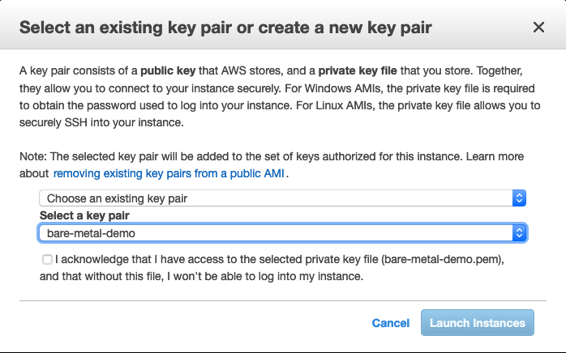
</p>

Clique em **Launch Instance**

Aguarde alguns minutos para que sua EC2 esteja pronta para ser acessada

<p align="center"> 
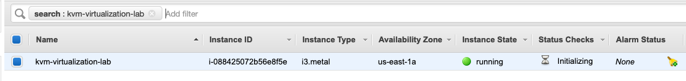
</p>

# Instalando o KVM

Neste repositório existem alguns scripts que nos ajudarão a realizar todos as etapas de configuração.

```bash
ssh -i bare-metal-demo.pem ubuntu@XXX.XXX.XXX.XXX
```

Realize SSH no servidor e siga os passos a seguir:


```bash
sudo su - 
```

```bash
cd /opt/ && apt-get update && apt-get install git -y
```

```
git clone https://github.com/BRCentralSA/bare-metal-nested-virtualization.git
```

Realize a instalacão do KVM e dos componentes necessários

```
cd bare-metal-nested-virtualization && ./install-kvm-ubuntu.sh
```

# Criando a primeira VM Ubuntu

Nesta demonstração iremos criar um servidor Ubuntu 18.04 com 1GB de RAM e 2 vCpu

```
./create-ubuntu-vm.sh
```

Aguarde a finalização da criação, pode levar algum tempo, após finalizar será necessário realizar o login novamente no servidor

Uma tela de Logon será mostrada, utilize o usuário e senha default.

**User:** ubuntu

**Pass:** ubuntu

<p align="center"> 
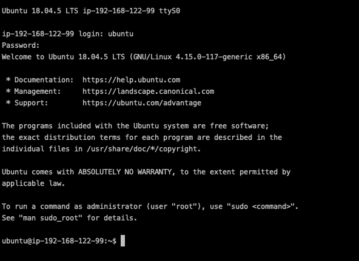
</p>

Volte para o Host OS e liste as VM'ms

```bash
sudo virsh -c qemu:///system list
```

<p align="center"> 
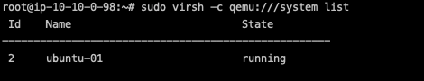
</p>

# Definindo um IP estático utilizando a rede Default Nat-based networking

Iremos utilizar a rede **default** criada no processo de instalação do KVM

Utilizando o **virsh**

Você pode criar, excluir, executar, parar e gerenciar suas máquinas virtuais a partir da linha de comando, usando uma ferramenta chamada virsh. Virsh é particularmente útil para administradores Linux avançados, interessados ​​em scripts ou automatizar alguns aspectos do gerenciamento de suas máquinas virtuais

```bash
virsh net-list
```


```bash
virsh net-info default
```

A rede baseada em NAT é comumente fornecida e habilitada como padrão pela maioria das principais distribuições de Linux que suportam virtualização KVM.

Esta configuração de rede usa uma ponte Linux em combinação com Network Address Translation (NAT) para permitir que um sistema operacional convidado obtenha conectividade de saída, independentemente do tipo de rede (com fio, sem fio, dial-up e assim por diante) usado no host KVM sem exigindo qualquer configuração de administrador específica.

## Definindo o IP estático para a nossa VM

Execute o script define-static-networking-kvm.sh

```bash
./define-static-networking-kvm.sh
```

Coloque o nome da máquina virtual que você quer definir o IP, no nosso caso é ubuntu-01

<p align="center"> 

</p>

Copie a linha que começa com **<host mac='**

Edite o arquivo de definição de rede

```bash
sudo virsh net-edit default
```
Adicione a linha que copiamos acima em baixo de **<range**

<p align="center"> 
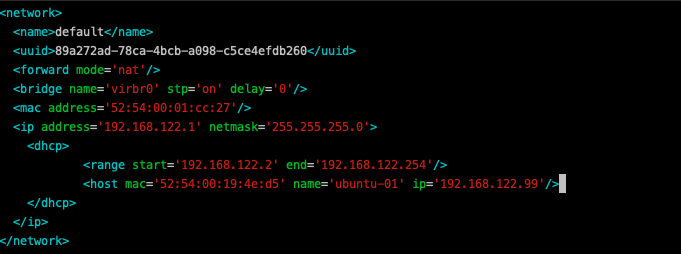
</p>

Salve o arquivo e execute os seguintes comandos

```bash
sudo virsh net-destroy default
```

```bash
sudo virsh net-start default
```

```bash
sudo virsh shutdown ubuntu-01
```

```bash
sudo systemctl stop libvirtd && sudo systemctl start libvirtd
```

```bash
sudo virsh start ubuntu-01
```

Teste o SSH para a nossa VM

```bash
ssh ubuntu@XXX.XXX.XXX.XXX
```

<p align="center"> 
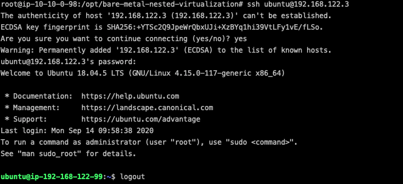
</p>

# Expondo nossa VM para acesso externo via IP Tables

Como estamos utilizando a configuração de rede default do tipo NAT não temos uma interface de rede adicionada em nossa máquina virtual, utilizaremos uma regra de IP Tables baseado em uma porta para realizar o acesso externo ao nosso servidor virtualizado

Utilizaremos o [Hooks do QEMU](https://libvirt.org/hooks.html)

Crie o seguinte arquivo **/etc/libvirt/hooks/qemu**

```bash
sudo vim /etc/libvirt/hooks/qemu
```

Adicione o seguinte conteúdo

```bash
#!/bin/bash

# Script that add iptables rule to forward traffic to VM's

if [ "${1}" = "VM NAME" ]; then

   # Update the following variables to fit your setup
   GUEST_IP=
   GUEST_PORT=
   HOST_PORT=

   if [ "${2}" = "stopped" ] || [ "${2}" = "reconnect" ]; then
	/sbin/iptables -D FORWARD -o virbr0 -p tcp -d $GUEST_IP --dport $GUEST_PORT -j ACCEPT
	/sbin/iptables -t nat -D PREROUTING -p tcp --dport $HOST_PORT -j DNAT --to $GUEST_IP:$GUEST_PORT
   fi
   if [ "${2}" = "start" ] || [ "${2}" = "reconnect" ]; then
	/sbin/iptables -I FORWARD -o virbr0 -p tcp -d $GUEST_IP --dport $GUEST_PORT -j ACCEPT
	/sbin/iptables -t nat -I PREROUTING -p tcp --dport $HOST_PORT -j DNAT --to $GUEST_IP:$GUEST_PORT
   fi
fi
```

Substituindo as seguintes variavéis pelas de nossas, em meu caso ficou assim:

```bash
#!/bin/bash

# Script that add iptables rule to forward traffic to VM's

if [ "${1}" = "ubuntu-01" ]; then

   # Update the following variables to fit your setup
   GUEST_IP=192.168.122.3
   GUEST_PORT=22
   HOST_PORT=2222

   if [ "${2}" = "stopped" ] || [ "${2}" = "reconnect" ]; then
	/sbin/iptables -D FORWARD -o virbr0 -p tcp -d $GUEST_IP --dport $GUEST_PORT -j ACCEPT
	/sbin/iptables -t nat -D PREROUTING -p tcp --dport $HOST_PORT -j DNAT --to $GUEST_IP:$GUEST_PORT
   fi
   if [ "${2}" = "start" ] || [ "${2}" = "reconnect" ]; then
	/sbin/iptables -I FORWARD -o virbr0 -p tcp -d $GUEST_IP --dport $GUEST_PORT -j ACCEPT
	/sbin/iptables -t nat -I PREROUTING -p tcp --dport $HOST_PORT -j DNAT --to $GUEST_IP:$GUEST_PORT
   fi
fi
```

Onde GUEST_IP é o IP da nossa VM, GUEST_PORT é a porta que faremos o redirecionamento do trafego nesse caso a porta do SSH, HOST_PORT a porta que mapearemos do host para a guest

```bash
sudo chmod +x /etc/libvirt/hooks/qemu
```

```bash
sudo virsh shutdown ubuntu-01
```

```bash
sudo systemctl stop libvirtd && sudo systemctl start libvirtd
```

```bash
sudo virsh start ubuntu-01
```

Testando o SSH, realize o log-off de nossa EC2 e realize o ssh apontando para a porta que faremos o forward via IP Tables.

> Obs: Não esqueça de liberar o Security Group na nossa EC2 para a porta 2222

```bash
ssh ubuntu@EC2_IP -p 2222
```

O resultado deve ser o mesmo de realizar o login de dentro do Host OS

<p align="center"> 

</p>

# Criando nosso primeiro servidor Windows

Criando nosso primeiro servidor Windows, para essa demo utilizaremos o [Windows Server 2019](https://www.microsoft.com/pt-br/windows-server), como não possuímos display gráfico em nossa EC2 realizaremos o setup via VNC (Virtual Network Computing)

## Pré-requisitos

- [ISO Windows Server 2019](https://www.microsoft.com/pt-br/evalcenter/evaluate-windows-server-2019)
- VNC Software


## Criando VM Windows

Utilizaremos scripts de apoio para criação do servidor Windows com 2GB de RAM e 4 vCpu


```
./create-windows-vm.sh
```
Aponte para a ISO que você fez o download nos pré-requisitos

<p align="center"> 
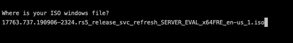
</p>

O processo de instalação será iniciado

<p align="center"> 
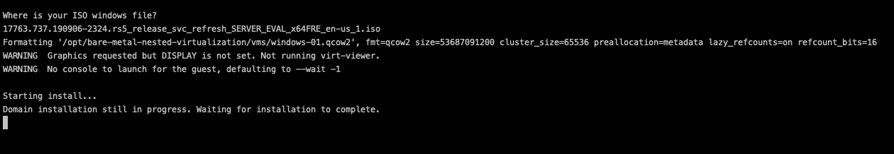
</p>

Precisaremos conectar via VNC em nossa máquina virtual para iniciar o setup de instalação do Windows gráficamente

<p align="center"> 

</p>

Conectaremos no **IP Público de nossa EC2 na porta 5904**

<p align="center"> 
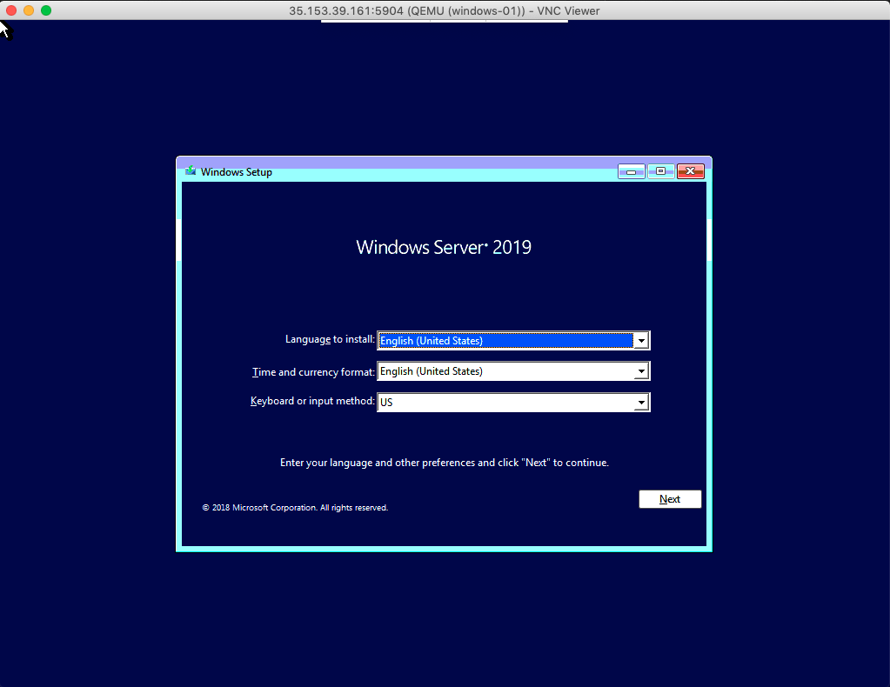
</p>

Clique em Next para iniciar a instalação e depois em Install Now

<p align="center"> 
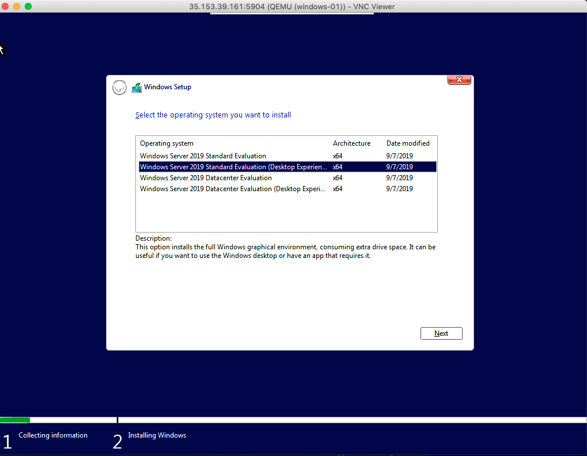
</p>

Selecione a segunda opção e clique em Next

<p align="center"> 
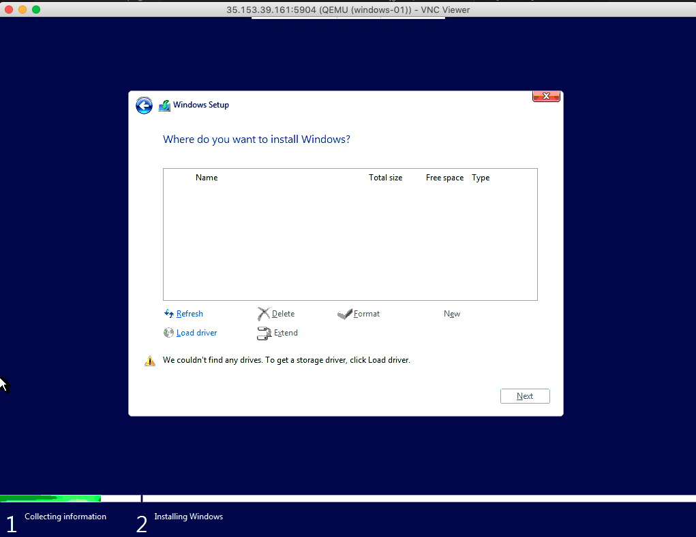
</p>

Clique em Load Driver, selecionaremos o driver do VirtIO

<p align="center"> 
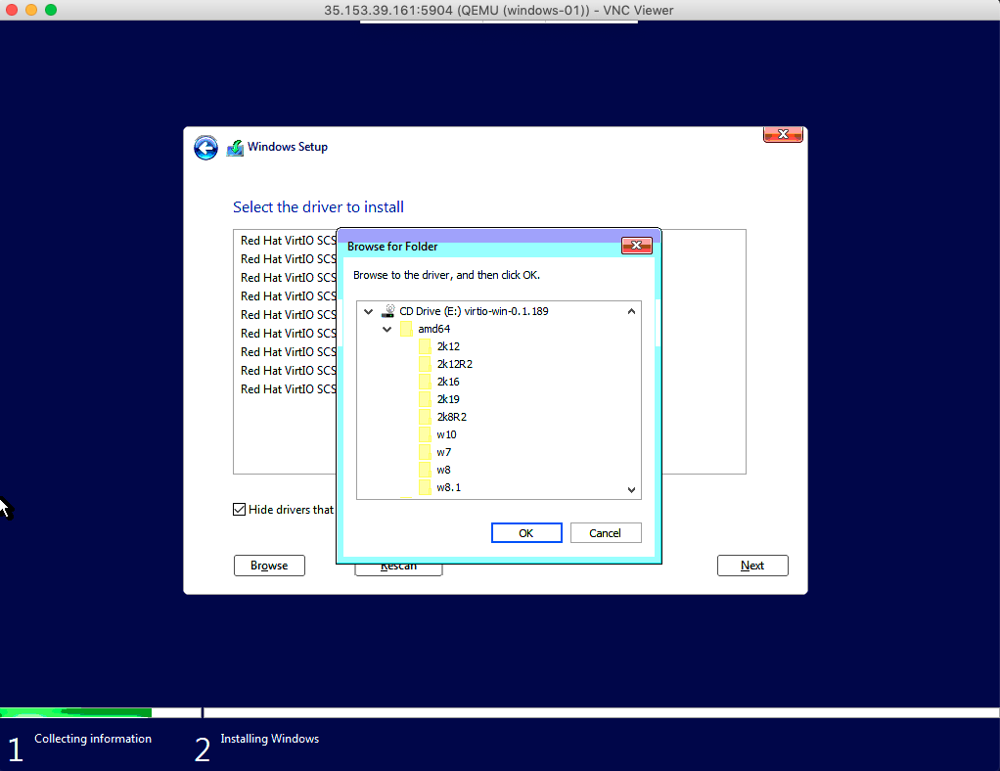
</p>

Clique em Browse > E: > amd64 > 2K19 e depois em Next

<p align="center"> 
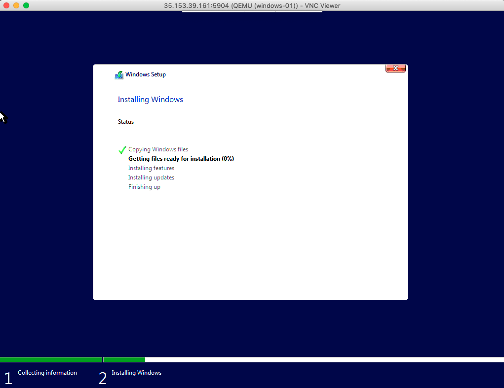
</p>

A Instalação será iniciada, aguarde até a finalização